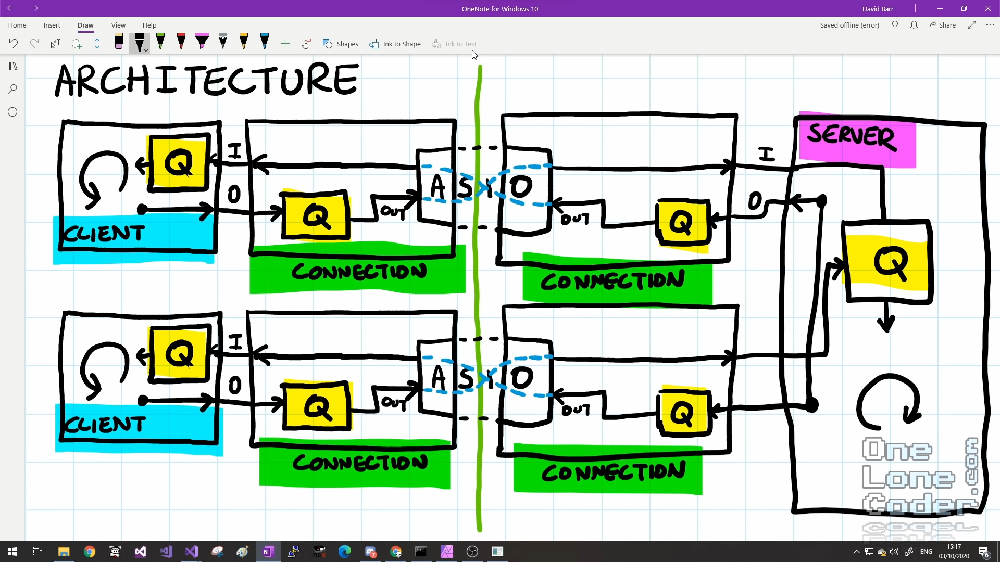
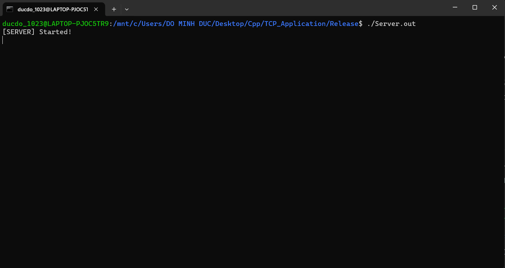

### Hệ điều hành : Ubuntu-22.04.
### Ngôn ngữ : C++ 17.
### Sơ đồ tổng quá của hệ thống\

### Các lệnh cài đặt cần thiết
* sudo apt-get install g++
* sudo apt-get install libboost-all-dev
### Hướng dẫn build và chạy chương trình Server và Client
* Vào thư mục Server gõ các lệnh sau
  * g++ Server.cpp -o Server.out
  * ./Server.out
* Vào thư mục Client gõ các lệnh sau
  * g++ Client.cpp -o Client.out
  * ./Client.out
### Hướng dẫn chạy chương trình
* Chạy chương trình Server đầu tiên và khi đó màn hình sẽ xuất hiện như sau\

* Chạy 2 chương trình Client tương ứng với Client 1 và Client 2 như sau\

* Sau đó mỗi Client sẽ nhập địa chỉ IP mà mình muốn giao tiếp và trả về kết quả connect\

* Client 1 muốn gửi tin nhắn tới Client 2 với lệnh như sau SENDTEXT `<text>`, ví dụ như SENDTEXT HELLO CLIENT và thu được kết quả\

* Client muốn gửi tin nhắn đến toàn bộ các client khác đang kết nối với Server với lệnh SENDTEXTALL `<text>`\

* Client muốn gửi file đến Client khác với lệnh như sau SENDFILE `<path>`\

* Kết quả trong file Release đã thu được file test.docx

